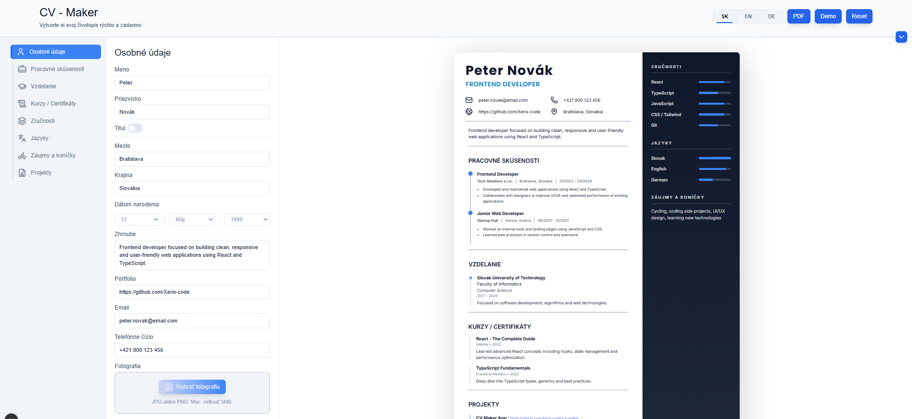
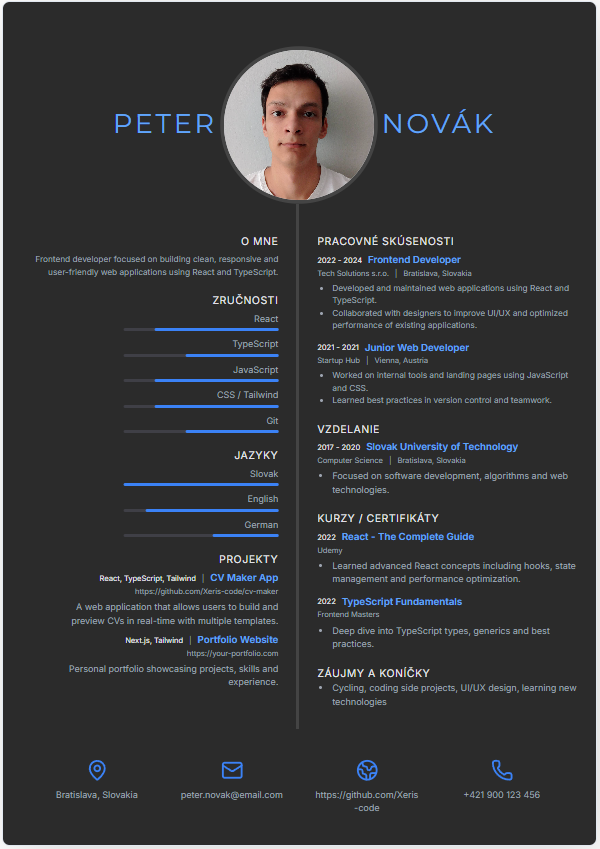
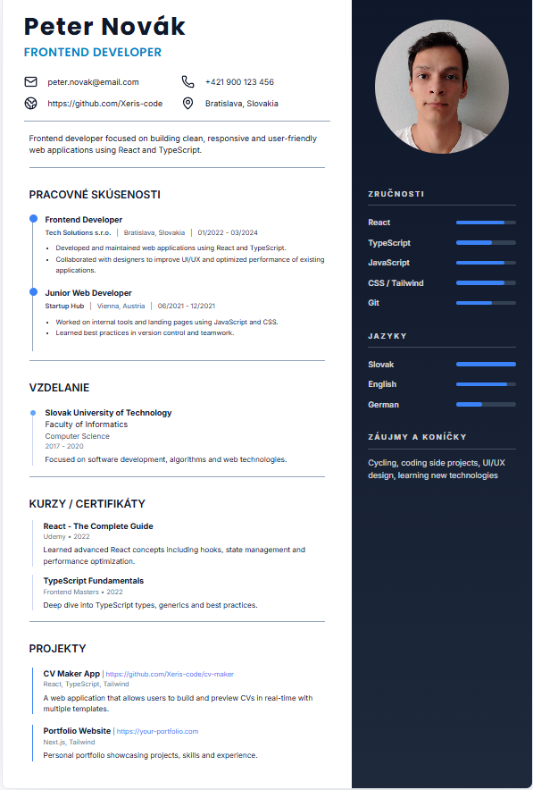

# CV Maker

Simple CV builder built with React and TypeScript.






## 👤 Author

Peter Cisovsky

## 🚀 Features

- Create and edit CV sections (Personal, Work, Education, Skills, etc.)
- Multiple templates
- Language switch (EN / SK / DE)
- Live preview
- Print to PDF
- Local Storage

## 🎯 Future Improvements
- Improve validation
- Add more templates
- Export as PDF file (server-side)
- Better mobile support

## 🛠️ Tech Stack

- React
- TypeScript
- Tailwind CSS

## 🧠 Architecture
- AppShell – main state and layout
- BuilderPanel – form sections
- PreviewPanel – CV preview
- sections/ – individual form sections
- ui/ – reusable components
- lib/ – types, reducer, helpers

## 📦 Installation

```bash
git clone https://github.com/Xeris-code/cv-maker
cd cv-maker
npm install
npm run dev