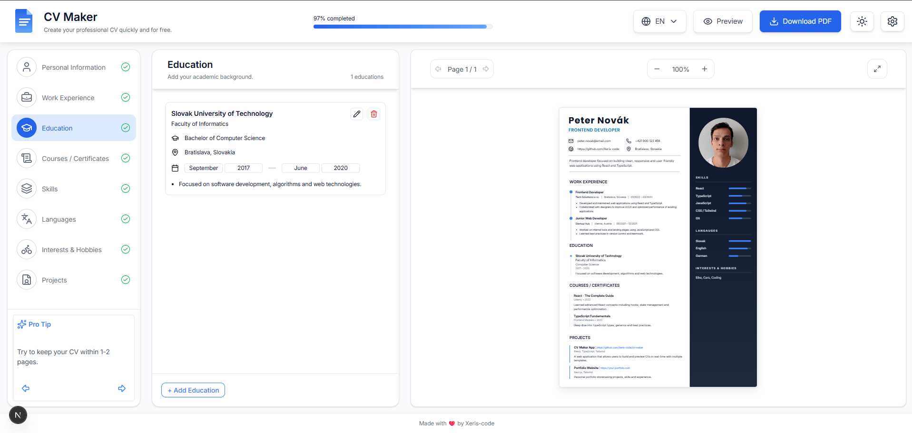

# CV Maker

Interactive CV and resume builder built with Next.js, React and TypeScript.

Live version: https://cv-maker.sk

Repository: https://github.com/Xeris-code/cv-maker

---

## About

CV Maker is a web application focused on creating clean, professional resumes directly in the browser.

The project was built to explore:
- dynamic form systems
- PDF generation
- live document preview rendering
- state-heavy frontend architecture
- responsive editor UX

The goal was to create a lightweight and fast resume builder with a modern developer-oriented UI.



---

## Features

### Resume Builder
- dynamic CV editing
- live preview updates
- section-based resume structure
- customizable content blocks
- responsive editor layout

### PDF Export
- client-side PDF generation
- downloadable resume output
- print-friendly formatting

### UI/UX
- responsive interface
- modern editor design
- real-time updates
- clean typography-focused layout

---

## Tech Stack

- Next.js
- React
- TypeScript
- TailwindCSS
- html2pdf.js

---

## Architecture

The application is structured around a reactive editor-preview pipeline:

```txt
User Input
   ↓
Form State
   ↓
Resume Data Model
   ↓
Live Preview Renderer
   ↓
PDF Export Layer
```

Main systems:
- form state management
- resume data structure
- preview rendering
- PDF generation pipeline
- responsive editor layout

---

## Example Features

### Live Resume Editing

```txt
Update personal information
→ preview updates instantly
```

### PDF Export

```txt
Generate downloadable PDF resume directly in the browser
```

### Dynamic Sections

```txt
Experience
Education
Skills
Projects
Languages
```

---

## Why I Built This

Most online CV builders are:
- overloaded with unnecessary features
- slow
- visually outdated
- locked behind subscriptions

I wanted to build a simpler and cleaner alternative focused on:
- speed
- UX
- minimalism
- developer-friendly design

This project was also used to improve:
- TypeScript architecture
- React state management
- dynamic form rendering
- document/PDF workflows

---

## Future Improvements

- multiple CV templates
- drag & drop section ordering
- dark/light themes
- cloud save support
- markdown support
- AI-assisted resume suggestions
- multilingual resumes

---

## Local Development

```bash
git clone https://github.com/Xeris-code/cv-maker.git

cd cv-maker

npm install

npm run dev
```

---

## Author

Peter "Xeris" Čišovský

- GitHub: https://github.com/Xeris-code
- LinkedIn: https://www.linkedin.com/in/xeris-code/
- Portfolio: https://xeris.sk